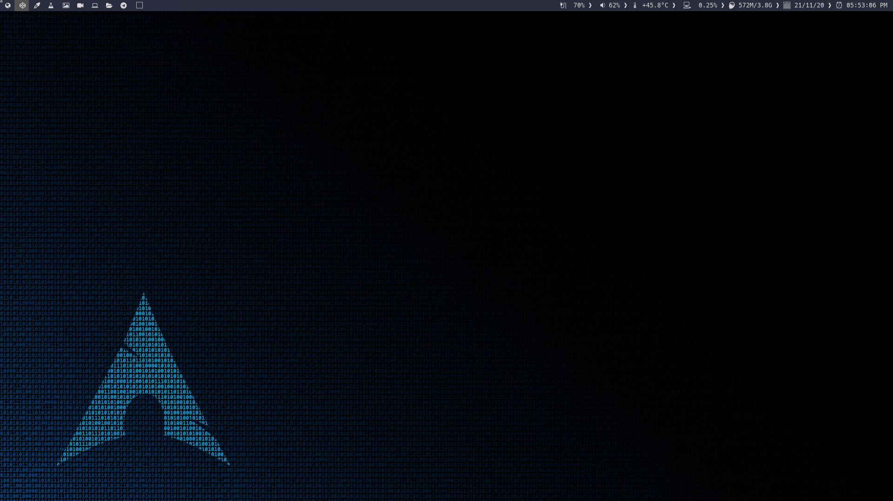
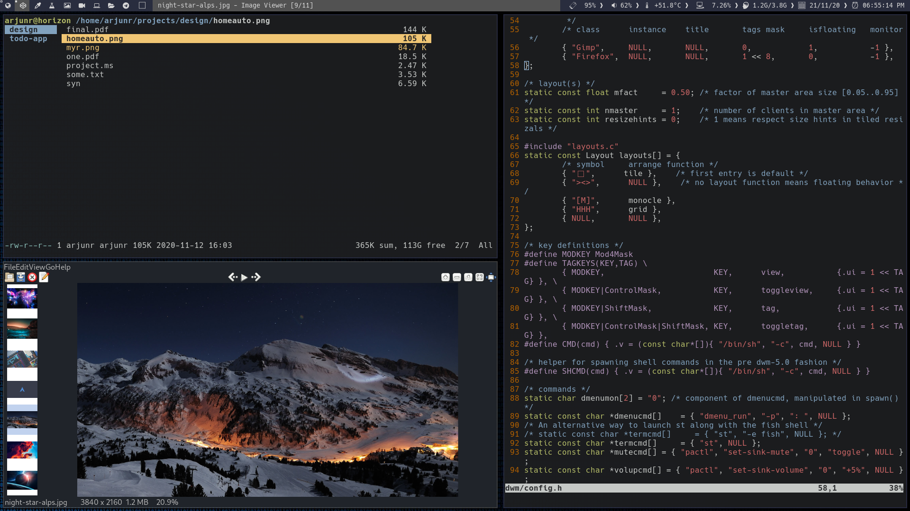

My updated build of dwm. 

## Keybindings

### Basic

[Mod]+[Enter]   - Launch terminal.

[Mod]+[b] - Show/hide bar.

[Mod]+[Shift]+[Enter] - dmenu for running programs 

[Mod]+[Shift]+c - Closes the window with focus

[Mod] + [j / k]         - focus on next/previous window in current tag.

[Mod] + [h / l]         - increases / decreases master size.

[Mod] + [Shift] + [x]   - Turn of computer

### Navigation

[Mod]+[2]               - moves your focus to tag 2.
[Shift]+[Mod]+[2]       - move active window to the 2 tag.

[Mod] + [i / d]         - increases / decreases number of windows on master
[Mod] + [, / .]         - move focus between screens (multi monitor setup)
[Shift]+[Mod]+[, / .]   - move active window to different screen.

[Mod]+[0]               - view all windows on screen.
[Shift]+[Mod]+[0]       - make focused window appear on all tags.
[Shift]+[Mod]+[c]       - kill active window.
[Shift]+[Mod]+[q]       - quit dwm cleanly.

### Layout

[Mod]+[t]               - tiled mode. []=
[Mod]+[f]               - floating mode. ><>
[Mod]+[m]               - monocle mode. [M] (single window fullscreen)

### Floating

[Mod]+[R M B]           - to resize the floating window.
[Mod]+[L M B]           - to move the floating window around.
[Mod]+[Space]           - to change the layout into floating mode.
[Mod]+[Shift]+[Space]   - to make an individual window float.
[Mod]+[M M B]           - to make an individual window un-float.

### Advanced

More of the keybindings can be found in [config.h](config.h)

## Installation

- Clone this repo
- Change directory into the dwm folder
- Edit the config file as per your liking
    
        vim config.h
        
- Save the file and install

        sudo make clean install
        
- To launch dwm, ideally you should setup a ~/.xinitrc with at least exec dwm.

### Screenshots

        
